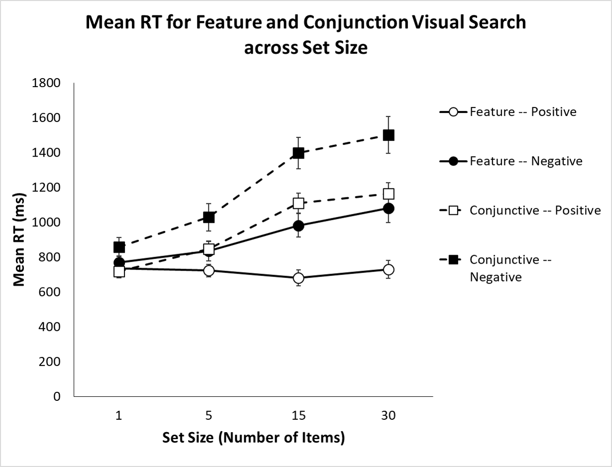

  

# Educational Materials  - Scientific Writing
Like many graduate researchers, I have created various teaching materials during my PhD, for example, code, presentations, and guides. Often, the many hours sunk into these works are lost to personal hard-drives or the trash-bin. Rather than waste this content, I aim to collate this material on my [GitHub](https://github.com/paulgarrettphd/Site/tree/master/presentations/studenteducation) and have begun to provide links and descriptions for all of my content on this site. Below, I provide descriptions and downloadable links for educational content targeted at undergraduate psychology students. Topics include scientific writing, statistics and making APA figures. A separate tab has been dedicated to resources on learning to code in Matlab. Feel free to download and share this content: it was made to help others.

## Statistics
Statistics can be difficult at the best of times. Often students progress quickly though statistical content with the aim of passing a single exam (e.g., run a t-test, ANOVA or ANCOVA). These tests are made simple in statistical programs such as SPSS, JASP or JAMOVI; however, students regularly forget the basics. For this reason, I created a simple crash course on understanding elements of basic statistics. This crash-course has helped numerous undergraduate psychology students quickly catch-up on simple (but critical) concepts in statistics, from students in first up to fourth year. Follow these links for a quick [crash course on basic stats](https://github.com/paulgarrettphd/Site/blob/master/presentations/studenteducation/Basic%20Stat%20with%20Paul.pptx), and [an excel walk-through on central measures](https://github.com/paulgarrettphd/Site/blob/master/presentations/studenteducation/CentralMeasures_Practice.xlsx); hopefully, you'll know it all anyway! 

## Report writing
Report writing is a critical skill for undergraduate scientists. Although these skills are needed to excel at many undergraduate courses, these skills are often not taught to students. During my time as a 2000/3000 level Psychology tutor, and as part of my private tutoring work in scientific methodology and design, I created a simple and clear walk-through. This tutorial covers the scientific method, report writing (what to include, where and why!), understanding and reporting statistical results (including interactions within two-way ANOVAs and simple effects), and an overview on how to write better (at an undergraduate level). Importantly, clear examples are given at every step so you can make the most of each section. Download this tutorial on [Report writing with Paul](https://github.com/paulgarrettphd/Site/blob/master/presentations/studenteducation/ReportWriting.pptx). 

During my time as a tutor, I often found that student's lacked an example of what they should aim to achieve and what markers might be looking for. Of course, some excellent students will go above-and-beyond to create a perfect report (and kudos to them!) But a benchmark example should be always be clearly established for students aiming to pass or receive a credit. This is especially important for students writing their very first 500 word report. To this end, I created a small example report with comments and feedback. The report isn't perfect, however, compliments the structure detailed in the above report-writing tutorial. If you are new to scientific report writing and want a simple example to work towards, this [example report](https://github.com/paulgarrettphd/Site/blob/master/presentations/studenteducation/Good%20Example%20Report%20with%20Comments.docx) was made for you. 

## APA figures 
Making clear, accurate APA style figures is an important skill in psychology. Although graduate students (PhD, Masters) often plot figures in programs such as Python, Matlab or R, undergraduate students often plot such figures in Excel. APA figures are simple to make, however, require several steps in Excel to get right. To make this process easier, students may download this simple [APA Plotting Walk-Though](https://github.com/paulgarrettphd/Site/blob/master/presentations/studenteducation/APAGraphGenerator_Practice.xls) for creating APA-style figures in Excel (example provided below). 

  

## Writing Better

Anyone who attempts or completes a PhD or Masters will tell you "writing is hard". In my experience, writing is the skill that graduate students require the most help with, after all, we only get better at writing through practice and feedback. Although there is no substitute for the process of writing-editing-feedback-writing; there are some helpful hints I have been taught and discovered along the way. These tips are targeted at those individuals who aim to complete a large body of work: honours, masters or PhD theses, academic papers or conference proceedings; however, these tips may also help undergraduates students or any intrepid writer. 

1. **Writing ≠ Editing** - Writing a clear and flowing document is hard work. It takes time, practice, and lots of editing; but writing is not editing. 
    - Writing is where you let ideas flow (or vomit in messy succession) onto the page. When writing, you don't worry about commas, or going back to fix a capital letter, or if the paragraph or sentence is too long. All you need to do is get the words out so that you have something to structure when you edit.
	- Editing is the process of taking your text, and refining it to fit the document structure (article, manuscript, report, letter), join paragraphs and create flow, to make sentences concise, and to ensure you have hit all of your key requirements (e.g., ensuring your research article as a clear aim!)
	- During my undergraduate degree, the difference between writing and editing was never stressed. I aimed to perform both processes simultaneous. Although my work received adequate marks, I never appreciated how a well written assignment shifted my a grade from a distinction to a high-distinction. The truth is, the easier your content is to read, the less-work your marker must put in, and the more time they have to look and give you the marks your work deserves. This goes triple for anyone dealing with reviewers when publishing scientific articles!

1. **Write a little, regularly** - If you need to write a large body of text, or indeed, many large bodies of text, it is important to stay in practice. Writing is a skill, and just like other cognitive skills (e.g., mathematics), if you don't use it you'll lose it.
    - Set a time. At least once a week, set some time aside to write (not edit!) early in the morning, even for half-an-hour. This time must be early, otherwise, you will find an excuse to put it off (e.g., meetings run overtime, other work comes up, coffee runs must be made). 
	- Use a timer. It is hard to focus on writing for an extended time, so don't. Write with a timed technique, such as the Pomodoro 'tomato timer' technique. Under the Pomodoro, you write uninterrupted for 25 minutes, break for five, and write for another 25. Easy, simple and very effective.

- **‘Park on the Hill’** - The hardest part about writing is starting. Make it easier by parking on the hill.
    - At the end of each writing session, don't simply stop at the end of a paragraph (tempting thought it is).
	- Help future you by writing some dot points on what your going to do next, so when you return, your job is easier and you are no longer facing the blank empty void that is your next paragraph.

- **Be accountable** - It's easy to say "I'll do it next week" or "It'll still be there tomorrow". We all make excuses for our lack of writing or find other 'useful' activities to blame for our procrastination. Stop this by being accountable.
    - If you are a student, make a writing group. It can just be you and a friend (it's how I got through my PhD Thesis - Thank Gabe!). Meet at a regular time and place, set small achievable goals at the start of each session (can just be an hour), and write. 
	- Make sure your friend can see whether you are meeting your goals, and work towards a reward (a coffee, a game, an hour's free time) for meeting each goal. 
	- If you are lucky enough to have a supervisor, make sure they see these goals and help keep you accountable.

- **Invest in grammar** - You probably cannot tell by my writing, but learning about grammar is a favourite past-time of mine. It started as a method of procrastination, but quickly developed into a skill I could use to improve my writing. Ever wonder "how do I use a semi-colon?", or "what's an Oxford comma?", what about "what's the difference between e.g., and i.e.,?", "what is a dash, en-dash and em-dash?" and "when do I use parentheses?" These are questions I had as I wrote. Learning the answers was fascinating and helped my text become much clearer.

- **Be Brief: Rule of 3s** - If you don't have a rule of thumb when writing scientific reports, use the rule of 3s. Put simply, this states there must be ≥ 3 words to a sentence, ≥ 3 sentences to a paragraph, and ≥ 3 paragraphs to a page. This rule is very harsh and is intended to enforce structure to your sentences and paragraphs, especially when used in tandem with the next point: topic and linkage sentences.

- **Topic & Linkage Sentences** - Your first sentence should tell the reader the primary message of the paragraph. Your last sentence should directly lead onto the topic sentence of the next paragraph. You middle sentence(s) are the 'body' of the argument raised in the first sentence. This structure enforces flow within and between paragraphs. Topic and linkage sentences are hard to achieve when you start (often you fix these when editing), but eventually, the use of this structure makes you a better writer and helps you present clear, strong arguments --- because every paragraph will clearly relate to one-another.

- **Active voice** - Use active voice: [e.g., Littel et al (2018) found that X impacts Y.], not passive voice [e.g., X has been shown to impact Y (Little et al, 2018)]. Active voice is engaging, it makes you want to read on! Passive voice is dispassionate and rather dull -- not something you want for your 5000 word essay!

- **Use sub-headings** - Sub-headings are a roadmap to your work, especially in scientific writing. If you are writing anything over 1500 words; you should probably have sub-headings. Not only do sub-headings give your reader a chance to pause and collect their thoughts, they provide a clear description of how your argument was made and where your marks should be allocated. Anything to help your marker give 'more marks' or better understand your argument is a good thing. 

These tips are small and simple, however, I have no doubt that they helped me write my 50,000 word PhD thesis and three academic articles in the space of six months. I endorse each of these tips fully, and hope they help other writers put words to page and maybe even learn to enjoy the writing process. 

