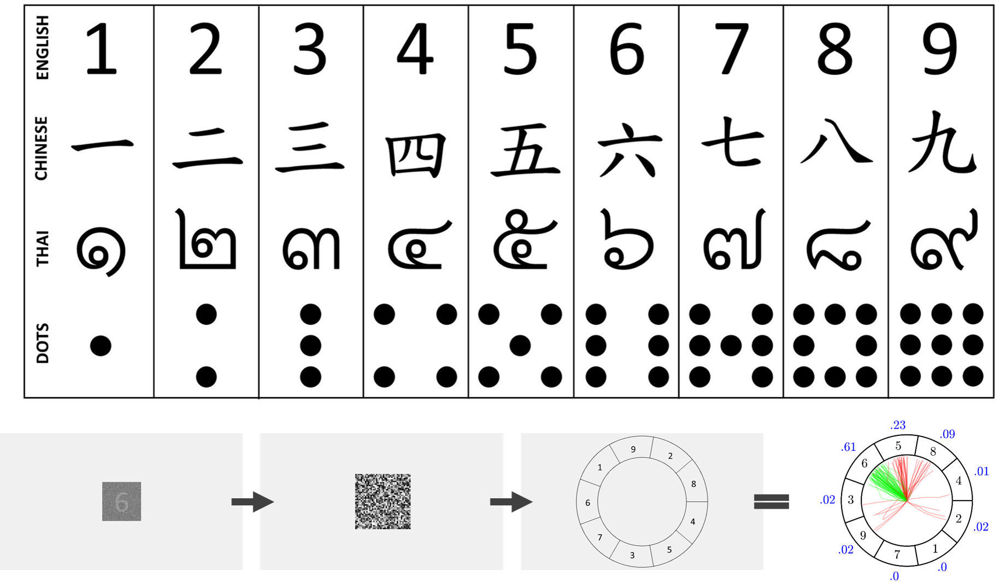
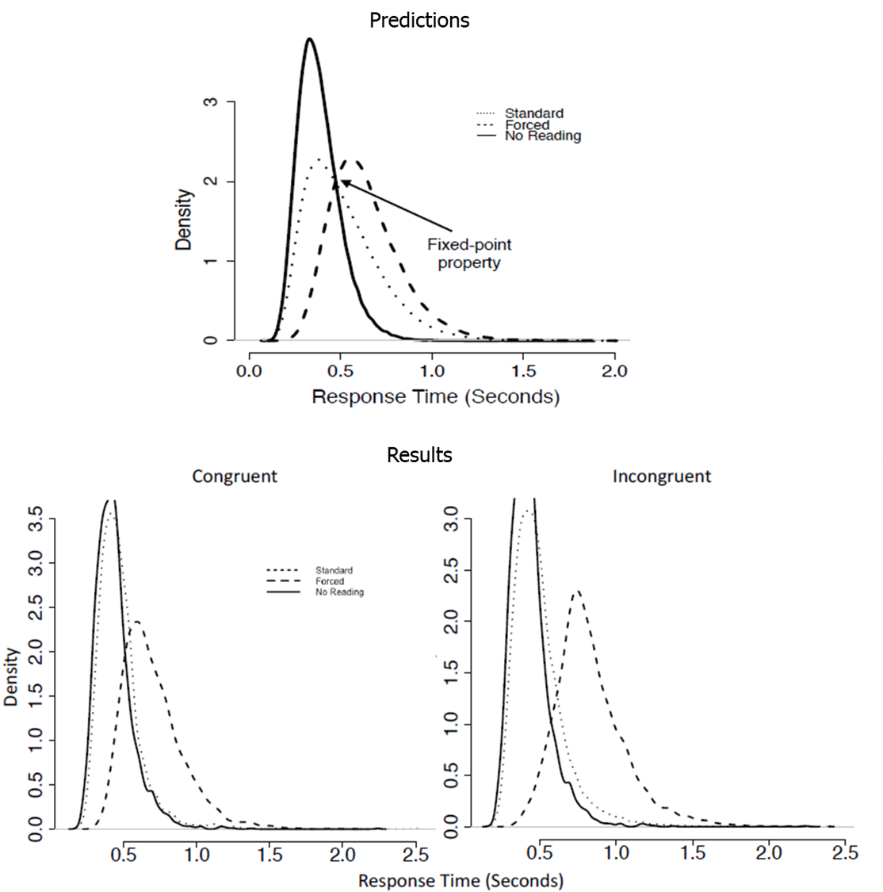
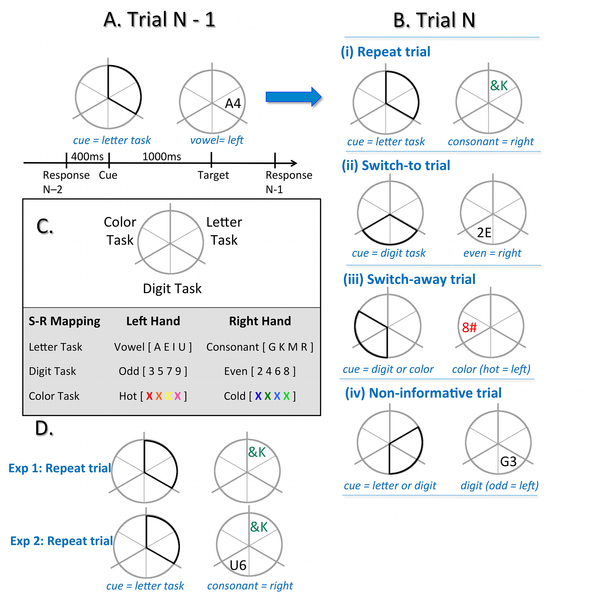
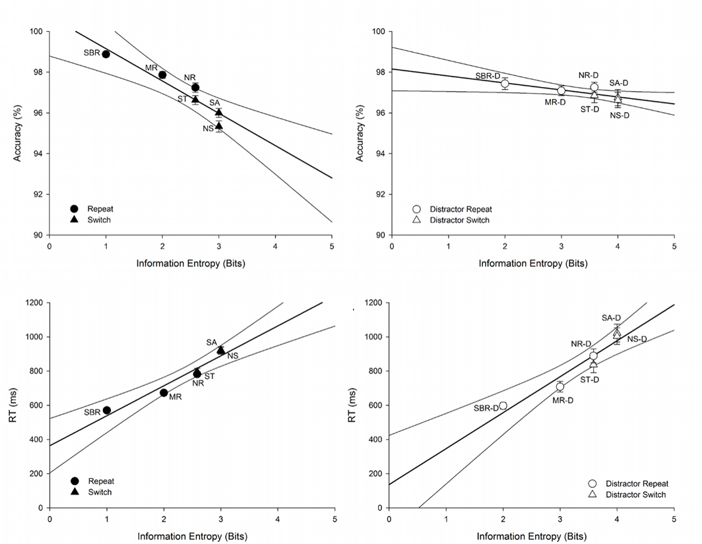

  

# Projects
My academic work covers a range of topics and has been summarised below. My research includes mathematical advancements and simulation work in Systems Factorial Technology, using experience sampling methods to investigate human memory, using non-parametric frameworks and multidimensional scaling to understand numerical cognition in English and Chinese speakers, and examining visual word processing efficiency for Chinese and English words. Some of these projects are on-going (Current Projects), while others are completed (Past Projects); all are presented below.

## Current Projects

### Word processing 
#### English and Chinese word processing efficiency
When we read, we process a limited number of letters and characters to form a single representation – a word. Whether we process words through a part-based or holistic visual process is a matter of conjecture, and may vary across writing systems. English words are alphabetic and may be processed in a more holistic manner than non-alphabetic words, such as Chinese characters. In the current project, Yang, Lin and I used response-times to examine visual word processing efficiency – a measure of holistic processing – in a Chinese speaking cohort, while matching Chinese characters and English words. Word type (word, pseudo-word, and non-word) and task instructions (recognize an identical vs different word) were manipulated, and processing efficiency was measured separately for whole word (AND) and word-part (OR) processing strategies. This work is on-going. Watch this space to learn how the results turn out!

### Numerical cognition
#### Expertise and the mental space
Symbolic numerals have been developed by various cultures to quickly and accurately convey quantity. People sometimes confuse one numeral for another, for example, 6 with 9. These confusion patterns relate to the distances between our mental representations --- hypothetical internal spaces thought to reflect the external world. Numerals separated by smaller distances in the mental space are easier to confuse. These distances may represent perceptual similarity or numerical proximity and may change with experience. For example, numerical proximity is only relevant after learning the numerical order. In a Chinese speaking cohort, Bennett, Howard, Hsieh, Yang, Little, Eidels and I investigated the mental representations of familiar and unfamiliar numerals (4 sets: Arabic, Chinese, Thai, and non-symbolic dots; see Figure 8) through a set of identification experiments, using multi-dimensional scaling and cluster analysis. We controlled for undesired effects of response bias using Luce’s choice model. To assess the effect of expertise, we compare the results of this study to those of an English speaking cohort (described in the following project). Across cohorts, our findings show Arabic, Chinese and Thai numerals were confused due to perceptual similarities. Non-symbolic dots were confused due to numerical and perceptual similarities. Mental representations differed between cohorts for Chinese numerals due to the different levels of expertise (see Figure 9).

  
 
<footer> *Figure 9.* Group indscal MDS solutions for the Chinese speaking cohort (left), English speaking cohort (middle) and a procrustes analysis fitting the English cohort to the Chinese cohort's MDS solutions (right). Colored items represent the English cohort's transformed MDS indscal solution fit to the Chinese MDS indscal solution. Standardised sum of squared errors (goodness of fit) is reported in the top left of each panel; a lower SSerror indicates a better fit between cohorts. The mental representation of Chinese digits differed most due to differences in the levels of Cohort expertise. Subjective interpretations describing how or why items were confused in each plot are presented on the external X- and Y-axes. Dot digits are displayed as Arabic numerals to avoid confusing these digits within the plot. </footer>

#### The mental representation of numerals
People express quantities using a remarkably small set of units – digits. Confusing digits could be costly, and not all confusions are equal; confusing a price tag of 2 dollars with 9 dollars is naturally more costly than confusing 2 with 3. Confusion patterns are intimately related to the distances between mental representations, which are hypothetical internal symbols said to stand for, or represent, 'real' external stimuli. The distance between the mental representations of two digits could be determined by their numerical distance. Alternatively, it could be driven by visual similarity. In an English speaking cohort, Bennett, Howard, Yang, Little, Eidels and I investigated the mental representations of familiar and unfamiliar numbers (4 sets: Arabic, Chinese, Thai, and non-symbolic dots; Figure 8 top) through a set of identification experiments (example, Figure 8 bottom), using multi-dimensional scaling and cluster analysis. We controlled for undesired effects of response bias using Luce’s choice model. Our findings show Arabic, Chinese and Thai numerals were represented in the mental space by perceptual similarities. We also find non-symbolic dots were represented by perceptual and numerical similarities. Read more about this in our preprint [The cost of errors: confusion analysis and the mental representation of familiar and unfamiliar digits](https://psyarxiv.com/eyvfd/), in review at Acta Psychologica.

  
 
<footer> *Figure 8.* (Top) stimuli for the four language types used in the experiment. (Bottom) Example of a trial; stimulus noise was degraded through a staircase procedure, and participants reported which item was presented by moving a mouse to the correct sector of the response-wheel. Correct (green) and error (red) responses were collected for each stimuli (response-proportions displayed by outer blue values) to create a 9 x 9 digit confusion matrix for each individual in each language condition. </footer>

## Past Projects

### Advancements to Systems Factorial Technology
#### Mixture Models
Human information processing is flexible in its ability to utilize mechanisms such as attention and memory along with basic perceptual processes. As a consequence, information processing is probably best thought of as not reflecting one type of standard system or architecture, but as a mixture of different types of systems. We examine the predictions of mixtures of different processing models using Systems Factorial Technology (Townsend and Nozawa, 1995). SFT offers a number of important diagnostic measures for differentiating pure processing models (e.g., serial or parallel). Little, Eidles, Houpt, Griffiths and I show that mixtures of basic processes result in smooth, gradual changes to these measures reflecting the proportions of each process (Figure 7). The identifiability of these mixtures, in comparison to interactive parallel channel models, is discussed with reference to the fixed-point property of mixture models. Read more in our article [Systems Factorial Technology analysis of mixtures of processing architectures](https://www.sciencedirect.com/science/article/abs/pii/S0022249618300865) published in the Journal of Mathematical Psychology.

  
 
<footer> *Figure 7.* Top: survivor interaction contrast (SIC) predictions for the self-terminating coactive/parallel (left) and self-terminating serial/parallel (right) mixture models. Bottom: survivor interaction contrast (SIC) predictions for the exhaustive coactive/parallel (left) and exhaustive serial/parallel (right) mixture models. Simulations of each component process were instantiated as a pair of Poisson accumulators. </footer>

#### Nice Guys Check Twice
Systems Factorial Technology (SFT) is a popular framework for that has been used to investigate processing capacity across many psychological domains over the past 25+ years. To date, it had been assumed that no processing resources are used for sources in which no signal has been presented (i.e., in a location that can contain a signal but does not on a given trial). Hence, response times are purely driven by the “signal-containing” location or locations. This assumption is critical to the underlying mathematics of the capacity coefficient measure of SFT. In this project, Howard, Little, Townsend, Eidles and I show that stimulus locations influence response times even when they contain no signal, and that this influence has repercussions for the interpretation of processing capacity under the SFT framework, particularly in conjunctive (AND) tasks - where positive responses require detection of signals in multiple locations. We propose a modification to the AND task requiring participants to fully identify both target locations on all trials. This modification allows a new coefficient to be derived. We apply the new coefficient to novel experimental data and resolve a previously reported empirical paradox, where observed capacity was limited in an OR detection task but super capacity in an AND detection task (see Figure 6). Hence, previously reported differences in processing capacity between OR and AND task designs are likely to have been spurious. Read more in our preprint [Nice Guys Check Twice: No-Signal Processes in Systems Factorial Technology](https://psyarxiv.com/b98wn/), submitted to Psych Review.

  
 
<footer> *Figure 6.* Group level averaged capacity coefficients for the same participants completing tasks requiring the OR-, AND-, and our new ID capacity coefficient. The coloured regions represent 1000 bootstrapped average capacity coefficients for each of the tasks. OR and ID capacity coefficients are similar to one-another whereas the AND coefficient is disparate. </footer>

### Numerical cognition
#### Systems of Estimation
Like many species, humans can perform non-verbal estimates of quantity through our innate approximate number system. However, the cognitive mechanisms that govern how we compare these estimates are not well understood. Little research has addressed how the human estimation-system evaluates multiple quantities, and fewer studies have considered the cost to cognitive workload when undertaking such a task. Here, we provide a novel application of Systems Factorial Technology (SFT; Townsend and Nozawa, 1995) to a comparative estimation task. Across a series of four experiments, Howard, Houpt, Landy, Eidels and I assess whether quantities, (i.e. non-overlapping red and blue discs), are estimated simultaneously (in parallel) or sequentially (in serial), and under what restrictions to cognitive workload. Our findings reveal that two item-sets may be estimated simultaneously through a parallel estimation system, under severe restrictions to cognitive workload capacity. These restrictions were so severe, as to make the parallel estimation of two quantities less efficient than the estimation of each quantity in succession. While the estimation of a single item-set may be colloquially considered an effortless process, our results show that the estimation of multiple item-sets is a rather demanding feat. Read more in our manuscript [Comparative estimation systems perform under severely limited workload capacity](https://www.sciencedirect.com/science/article/abs/pii/S0022249618301196?) published in the Journal of Mathematical Psychology.

#### Systems of Subitizing
Whether we realise it or not, many everyday comparisons of quantity occur within the subitizing range, 1--4. For example, when we choose the fewer of two coffee queues, we may rapidly subitize each queue before deciding which one to join. As we go to pay, we might empty our wallet of coins and subitize the gold coins from amongst the silver shrapnel. In both of these instances, we are using a subitizing system to evaluate item-sets when those sets are physically separate or intermixed. But under what processing architecture and workload capacity does this subitizing system operate? In this project, Thorpe, Landy, Houpt, Eidels and I investigate whether two small item-sets (see Figure 5) may be subitized at the same time through a parallel subitizing system. We find that, contrary to our expectations, two item-sets must be subitized one-after-another in a serial processing system. We observe that processing operates under severe limitations to workload capacity (processing efficiency). This finding indicates the presence of additional context effects that slow the subitizing of two item-sets beyond the sum processing-times expected for subitizing each item-set in isolation. These findings held across conditions of separation and across manipulations of item-set area (see Figure 5).

  
 
<footer> *Figure 5.* Example stimuli for when participants had to identify if either color set contained less-three three discs, when discs were of a fixed size (left), and when item-set area was fixed (right); for mixed and separate item-set designs. Each example illustrates a conflict-target response-condition, where one color-set was fewer than three, and one color-set was greater than three.  </footer>

### Memory 
#### Hierarchical Bayesian model of memory for 'when'
In this project, Dennis, Yim, Sreekumar, Evans, Stone, Sederberg and I asked participants to wear a smartphone, which collected GPS, audio, accelerometry and image data, in a pouch around their necks for a period of two weeks (Figure 4; left). After a retention interval of one week, they were asked to judge the specific day on which each of a selection of images was taken. To account for people’s judgements, we proposed a mixture model of four processes - uniform guessing, a signal detection process based on decaying memory strength, a week confusion process and a event confusion process in which the sensor streams were used to calculate the similarity of events. A model selection exercise testing all possible subsets of the processes favoured a model that included only the event confusion model (Figure 4; middle). GPS similarities were found to be the most significant predictors of memory, followed by audio and accelerometry similarities and then image similarities (Figure 4; right). To read more on this, see our article [A hierarchical Bayesian model of “memory for when” based on experience sampling data](https://mindmodeling.org/cogsci2017/papers/0066/paper0066.pdf).

  
 
<footer> *Figure 4.* Participant wearing smart-phone (left), sensory event based model that confused memories based upon day proximity (middle) and associated predictive weights of each sensor (right). </footer>

#### An Unforgettable Experience
Online and sensor technologies promise to transform many areas of psychological enquiry. However, collecting and analyzing such data are challenging. In this project, Dennis, Yim, Sreekumar, Stone and I introduce the unforgettable.me experience-sampling platform. Unforgettable.me includes an app that can collect image, Global Positioning System, accelerometry, and audio data in a continuous fashion and upload the data to a server. The data are then automatically augmented by using online databases to identify the address, type of location, and weather conditions, as well as provide street view imagery. In addition, machine-learning classifiers are run to identify aspects of the audio data such as voice and traffic. The augmented data are available to participants in the form of a keyword search interface, as well as via several visualization mechanisms. In addition, Unforgettable Research Services partners with If This Then That (IFTTT), and so can accumulate data from any of over 600 sources, including social media, wearables, and other devices. Through IFTTT, buttons can be added as icons to smartphones to allow participants to register mood conveniently, as well as behaviors and physiological states such as happiness, microaggressions, or illness. Furthermore, unforgettable.me incorporates a mechanism that allows researchers to run experiments and analyze data within an authenticated environment without viewing users' private data. To read more on this, see our article [A system for collecting and analyzing experience sampling data.](https://www.ncbi.nlm.nih.gov/pubmed/31240631) published in Behaviour Research Methods or visit the [Unforgettable.me](https://www.unforgettable.me/) website.

## Word processing
### Stroop effect: Fixed point analysis
For the last 80 years, the Stroop task has been used to test theories of attention and cognitive control. The Stroop task involves naming the print color of a word, where the word itself is typically the name of a color (e.g., the word  GREEN  printed in red print requires a response of 'red’; Stroop, 1935). People are faster at naming the print color when it matches the word (congruent stimuli, e.g.,  RED  in red) compared to when the word and print color do not match (incongruent stimuli,  GREEN  in red). Most theories posit that the overwhelming power of written word overcomes the strict instructions to focus on print color. Recent evidence suggests that trials in the Stroop task could in fact be a mixture of reading trials and non-reading trials. Identifying mixtures of two processes is a notoriously difficult task, with the diagnosis of mixture processes requiring strict assumptions to hold. In this project, Tillman, Howard, Eidels and I conduct a critical test of the Stroop reading-color mixture process. We assume that, given these mixtures are linearly additive, a mixture of these processes should satisfy the fixed-point property (Falmagne, 1968). Although we found some evidence for a mixture of distributions using the fixed-point analysis in the incongruent condition, the results of this project were not conclusive. To read more about this project, see our article [The Stroop Effect From a Mixture of Reading Processes: A Fixed-Point Analysis](https://www.researchgate.net/publication/316597653_The_Stroop_Effect_From_a_Mixture_of_Reading_Processes_A_Fixed-Point_Analysis), published in the Proceedings of the 39th Annual Conference of the Cognitive Science Society. 

  
 
<footer> *Figure 3.* Predictions of the fixed point property (top) and overall RT density for congruent and incongruent Stroop distributions (bottom). Some evidence for a mixture of distributions using the fixed-point analysis was found for the incongruent condition, but not for the congruent condition. </footer>

### Open Science
#### Privacy vs Open Science
Pervasive internet and sensor technologies promise to revolutionize psychological science. For example, my recent work with Dennis, Yim, Stone and collogues allows the passive collection of GPS, accelerometry, image, and audio data from participant's smart-phones. The data collected using internet and sensor technologies are often very personal and the value of this data increases with its sensitivity (e.g., email meta data vs medical record data). At the same time, driven by the replication crisis, there is a sustained push to publish data to open repositories. These movements are in fundamental conflict. 

In this project, Dennis Yim, Hamm, Osth, Sreekumar, Stone and I propose a way to navigate this issue. We argue that there are significant advantages to be gained by ceding the ownership of data to the participants who generate the data. We then provide desiderata for a privacy-preserving platform called Unforgettable.me. In particular, we suggest that researchers should use an interface to perform experiments and run analyses, rather than observing the stimuli themselves. We argue that this method not only improves privacy but will also encourage greater compliance with good research practices than is possible through open repositories. To read more on this, see our article [Privacy vs Open Science](https://link.springer.com/article/10.3758/s13428-019-01259-5), published in Behaviour Research Methods. 

## Task Switching
### Measuring uncertainty in switch costs
Cognitive control is required in situations that involve uncertainty or change, such as when resolving conflict, selecting responses and switching tasks. It has been suggested that cognitive control can be conceptualised as a mechanism which prioritises goal-relevant information to deal with uncertainty. This hypothesis has been supported using a paradigm that requires conflict resolution. In this project, Cooper, Rennie, Karayanidis and I examined whether cognitive control during task switching is also consistent with this notion. 

Using information theory, we quantified the level of uncertainty in different trial types during a cued task-switching paradigm (see Figure 1). We test the hypothesis that differences in uncertainty between task repeat and task switch trials can account for typical behavioural effects in task-switching. Increasing uncertainty was associated with less efficient performance (i.e., slower and less accurate; see Figure 2), particularly on switch trials and trials that afford little opportunity for advance preparation. Interestingly, both mixing and switch costs were associated with a common episodic control process. Our entropy algorithm was then generalized and fit to 20 other experiments from 12 different studies, proving to be a good predictor of behavioural performance across all experiments. The results of this project support the notion that cognitive control may be conceptualised as an information processor that serves to resolve uncertainty in the environment. To read more on this, see our published manuscript [Task Uncertainty Can Account for Mixing and Switch Costs in Task-Switching](https://journals.plos.org/plosone/article?id=10.1371/journal.pone.0131556) published in Plos One.

  
 
<footer> *Figure 1.* A) Timeline of a specific trial. Response-cue interval (RCI) and cue-target interval are fixed at 400 ms and 1000 ms, respectively. On each trial, the cue highlights two of the six segments of the circle and indicates that the target will appear in one of these two segments. In this instance, the cue covers both ‘letter task’ segments, and the participant can prepare to apply the ‘letter’ task rules on the upcoming target. When the target (e.g., A4) appears in a letter task segment, participants must respond to the task-relevant feature of the target (e.g., the letter A is a vowel, respond with left hand), and ignore the task-irrelevant feature of the target (e.g., the number 4). B) The progression from trial N-1 to trial N defines the trial type. i) If, having completed the letter task on trial N-1, the same segment is highlighted on trial N, it is a repeat trial and the participant will repeat the letter task. ii) If the cue highlights both segments of one of the other tasks, it is a switch-to trial. The target will appear in one of the two highlighted segments, and the participant can use the CTI to update the new task rules (e.g., digit task, in this example). iii) If the cue highlights adjoining segments of the two tasks not completed on trial N-1 (e.g., digit and color), it is a switch-away trial. The target is equally likely to appear in the digit and color segments and the participant can prepare to switch task (e.g., not repeat the letter task), but does not know which task to upload until the target appears. The position of the target indicates which task to complete. iv) If the cue highlights one segment from the task completed on trial N-1 (e.g., letter task) and one from another task (e.g., digit task), it is a non-informative trial. The target is equally likely to appear in the letter or the digit segment, and require either a repeat (non-informative repeat) or a switch (non-informative switch) in task. C) Each major segment of the wheel is consistently mapped to one of the three tasks: letter, digit and color. The table shows the eight exemplars used for each task and an example of stimulus-response mappings. D) Exemplar differences between a repeat trial for Experiment 1 and Experiment 2, whereby an additional bivalent distractor is presented at target onset in a non-cued section of the wheel during Experiment 2. </footer>

  
 
<footer> *Figure 2.* Information processing requirements (in bits) were assumed to differ based on an increased entropy for mixed blocks in contrast to single blocks, with the addition of an extra degree of uncertainty for switching within a mixed-task block. Our algorithm strongly predicted mixing and switch costs for accuracy in both Experiment 1 (A: r2 = .886, p = .005) and Experiment 2 (B: r2 = .701, p = .038) and for RT in both Experiment 1 (A: r2 = .934, p = .002) and Experiment 2 (B: r2 = .924, p = .002). SBR; single block repeat, MR; mixed repeat, ST; switch-to, SA; switch-away, NR; non-informative repeat, NS; non-informative switch. –D denotes distractor paradigm trials. </footer>
